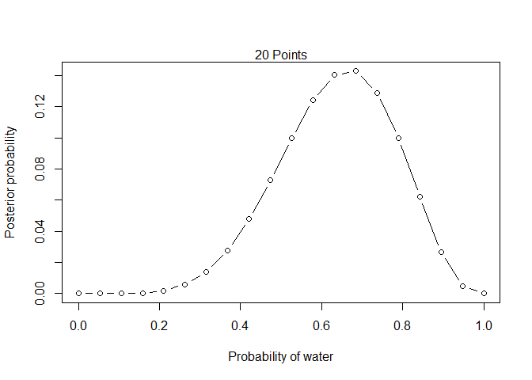

Chapter 2
================

# Chapter 2: Small Worlds and large worlds

### Grid Approximation

1.  Define the grid.
2.  Compute the value of prior at each parameter value of grid.
3.  Compute the likelihood at each parameter value.
4.  Compute the unstandardized posterior at each parameter value, by
    multiplying the prior by the likelihood.
5.  Standardize the posterior

Scales poorly with model complexity, not used.

``` r
# define grid
p_grid <- seq(from = 0, to = 1, length.out = 20)

# define prior
prior <- rep(1, 20)

# compute likelihood at each value in grid
likelihood <- dbinom(6, size = 9, prob = p_grid)

# compute product of likelihood and prior
unstd.posterior <- likelihood * prior

# standardize the posterior
posterior <- unstd.posterior / sum(unstd.posterior)
```

``` r
# plot
plot(p_grid, posterior, type = 'b', xlab = 'Probability of water', 
     ylab = 'Posterior probability')
mtext("20 Points")
```

<!-- -->

### Quadratic Approximation

``` r
library(rethinking)
```

    ## Loading required package: rstan

    ## Loading required package: StanHeaders

    ## Loading required package: ggplot2

    ## rstan (Version 2.21.2, GitRev: 2e1f913d3ca3)

    ## For execution on a local, multicore CPU with excess RAM we recommend calling
    ## options(mc.cores = parallel::detectCores()).
    ## To avoid recompilation of unchanged Stan programs, we recommend calling
    ## rstan_options(auto_write = TRUE)

    ## Do not specify '-march=native' in 'LOCAL_CPPFLAGS' or a Makevars file

    ## Loading required package: parallel

    ## rethinking (Version 2.13)

    ## 
    ## Attaching package: 'rethinking'

    ## The following object is masked from 'package:stats':
    ## 
    ##     rstudent

``` r
globe.qa <- quap(
  alist(
    W ~ dbinom(W+L, p),
    p ~ dunif(0, 1)
  ),
  data = list(W = 6, L = 3)
)

# display summary of quadratic approximation
precis(globe.qa)
```

    ##       mean        sd      5.5%    94.5%
    ## p 0.666667 0.1571337 0.4155371 0.917797
